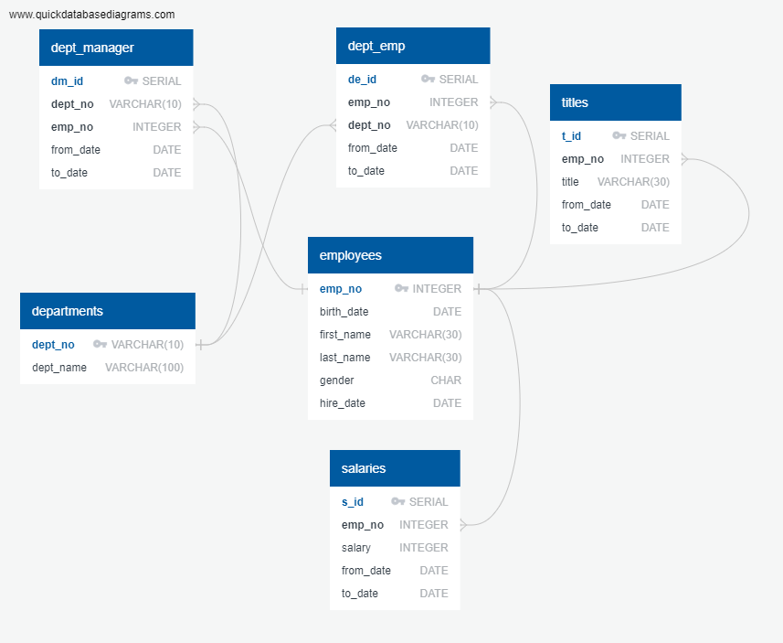

# Employee Database

### Objective

The included six CSV files content information about employees from one fictional corporation during the period from the 1980s and 1990s. 

We designed the tables to hold data in the CSVs, imported the CSVs into a SQL database, and performed data analysis with SQL and Python.

#### Data Modeling

In this phase we inspected the CSVs and sketched out an ERD (Entity Relationship Diagram) of the tables using this tool: http://www.quickdatabasediagrams.com.

This is our  ERD (*Images/sql-ERD.png*):

#### **Data Engineering**

- First, we created a table schema for each of the six CSV files:

  *sql-schema.sql*

  and created tables in PostgreSQL.

- Next, we imported each CSV file into the corresponding SQL table.

#### **Data Analysis**

##### PostgreSQL

The file *sql-query.sql* contents all queries needed to resolve the following tasks:

1. List the following details of each employee: employee number, last name, first name, gender, and salary.
2. List employees who were hired in 1986.
3. List the manager of each department with the following information: department number, department name, the manager's employee number last name, first name, and start and end employment dates.
4. List the department of each employee with the following information: employee number, last name, first name, and department name.
5. List all employees whose first name is "Hercules" and last names begin with "B."
6. List all employees in the Sales department, including their employee number, last name, first name, and department name.
7. List all employees in the Sales and Development departments, including their employee number, last name, first name, and department name.
8. In descending order, list the frequency count of employee last names, i.e., how many employees share each last name.

#####  Python / Pandas / SQLAlchemy

In the Jupyter Notebook, *sql-bonus.ipynb*, we generated a visualization of the data:

1. First, we Imported the SQL database into Pandas. 
2. Then we created a histogram to visualize the most common salary ranges for employees.
3. At the end, we created a bar chart of average salary by title.

 

### Tools / Techniques Used:

- PostgreSQL
- SQLAlchemy
- to draw ERD: http://www.quickdatabasediagrams.com/ 
- Python
- Pandas
- Matplotlib
- Jupyter Notebook

### About Data

 Six datasets have been provided for this project. 

1. <u>***data/departments.csv***</u> - contains departments information:

- **Number of records:**      9

- **Columns**:
  - dept_no
  - dept_name

2. <u>***data/dept_emp.csv***</u> - department history for employees:

- **Number of records:**      331,603
- **Columns**:
  - emp_no
  - dept_no
  - from_date
  - to_date

3. ***<u>data/dept_manager.csv</u>*** - department history of managers:

-  **Number of records:**      24
-  **Columns**:
   -  dept_no
   -  emp_no
   -  from_date
   -  to_date

4. ***<u>data/employees.csv</u>*** -  contains employees information:

-  **Number of records:**      300,024
-  **Columns**:
   -  emp_no
      birth_date
      first_name
      last_name
      gender
      hire_date

5. ***<u>data/salaries.csv</u>*** - salary history of employees:

-  **Number of records:**     300,024
-  **Columns**:
   -  emp_no
      salary
      from_date
      to_date

6. ***<u>data/titles.csv</u>*** - title history of employees:

- **Number of records:**      443,308
- **Columns**:
  - emp_no
  - title
  - from_date
  - to_date